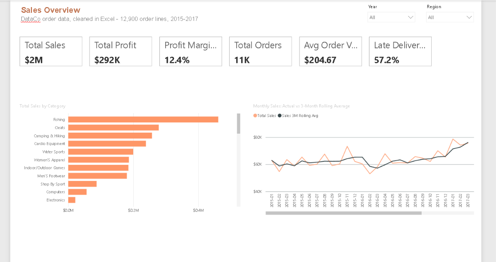
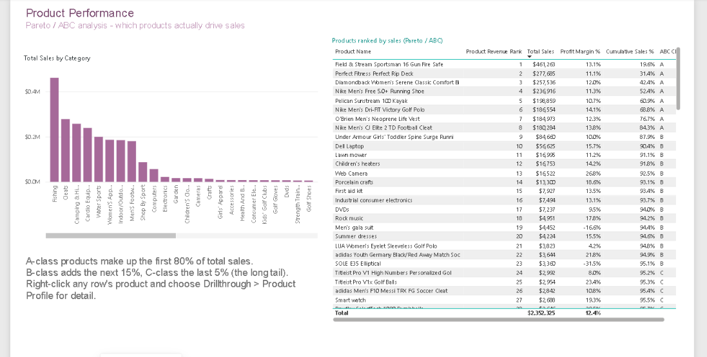
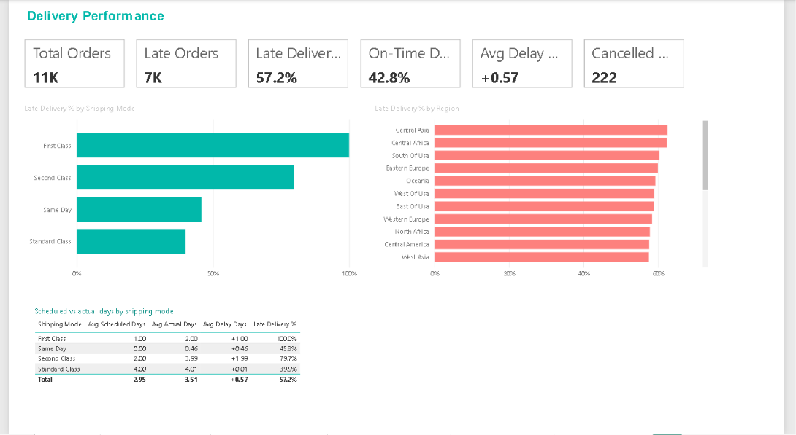
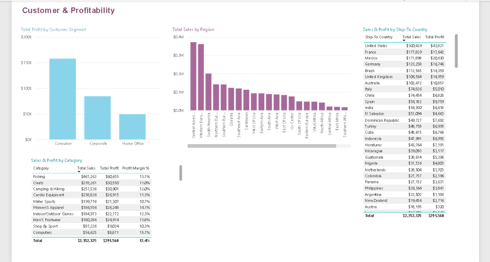
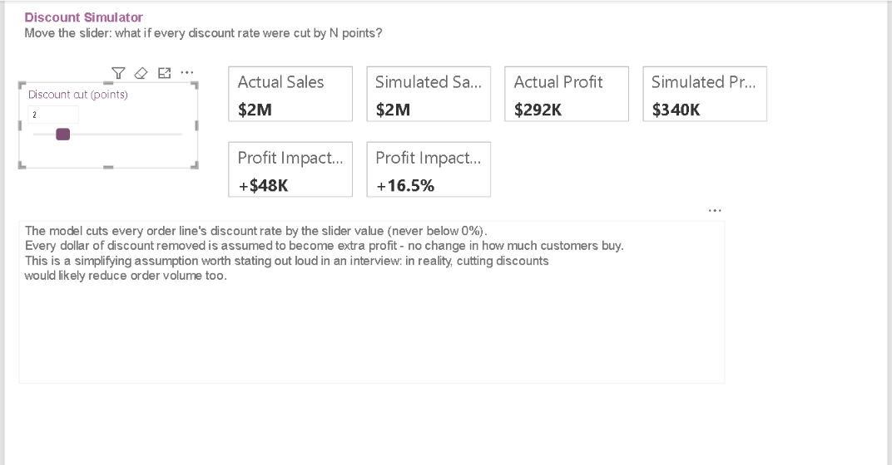
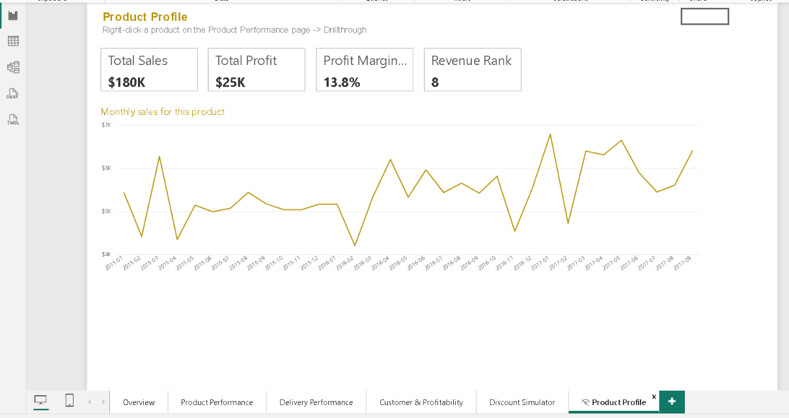

# Sales & Delivery Performance Dashboard

A sales analytics dashboard built on a cleaned, 12,900-row order dataset.
Data cleaning was done entirely in Excel (XLOOKUP, IFERROR, DATEVALUE, IF);
the dashboard and all measures were built in Power BI with DAX.

## Dashboard

## Key findings
- 57.2% of orders arrived later than their scheduled shipping window
- Overall profit margin: 12.4% on $2.35M in total sales
- Top 3 categories by revenue: Fishing, Cleats, Camping & Hiking

## How it's built
**Excel (`data/DataCo_Cleaned.xlsx`)**
- `Raw_Import`: data as exported (inconsistent dates, Spanish country names)
- `Lookups`: country-name translation table
- `Clean_Data`: formula-driven cleaning — XLOOKUP + IFERROR for country lookup,
  DATEVALUE for date parsing, IF for delivery-status flags, TRIM/PROPER for text cleanup
- `Data_Quality_Checks`: COUNTIF/COUNTBLANK/SUMPRODUCT validation

**Power BI (`powerbi/`)**
- Star-style model: one fact table + a Date table
- 27 DAX measures: sales/profit totals, time intelligence (YTD, rolling average),
  Pareto/ABC product ranking (RANKX), and a discount what-if simulator
- 6 report pages including a drill-through Product Profile page

## To open
1. Open `data/DataCo_Cleaned.xlsx` in Excel first — this is the data source.
2. Open `powerbi/DataCo Dashboard.pbip` in Power BI Desktop.
3. If it can't find the Excel file, go to Transform Data → Manage Parameters →
   DataFolder, and point it at the folder containing DataCo_Cleaned.xlsx.
4. Click Refresh.

## Dataset
Based on the [DataCo Smart Supply Chain dataset](https://data.mendeley.com/datasets/8gx2fvg2k6/5) (Mendeley Data).
